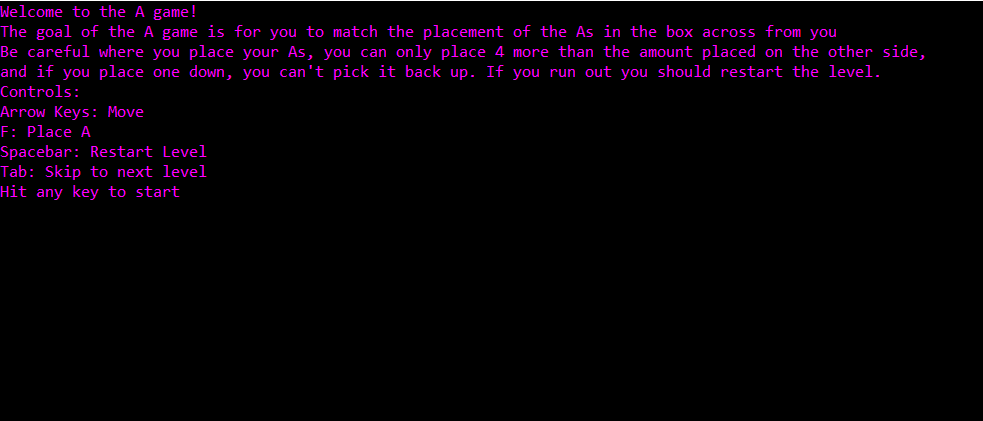
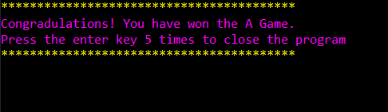
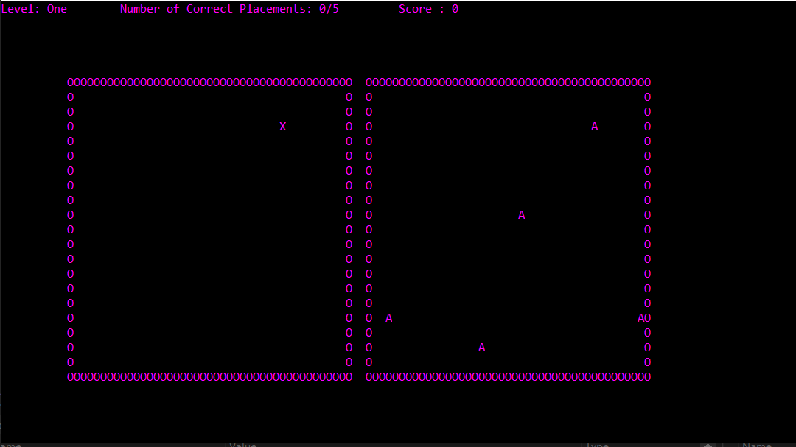
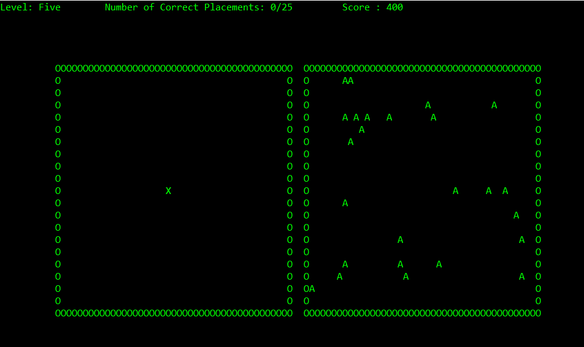

# The A Game
This was my final for my first programming class; a simple C# console app game. The game is called the A Game, it's premise is that on one side of the screen the application will randomly generate a series of letter "A"s in a box. The user's task is to place down where they estimate the "A"s to be, whether that be through careful counting of the border or trying to eyeball the placement and estimate about where they are.
## Game
### Menus
The intro page, establishes the controls for the game.
  

The success page congratulating the player for finishing the game.
  

### Levels

The game starts at level 1 with a few letter "A"s, and each subsequent level has more.
  

And progresses to a final level 5.
  
